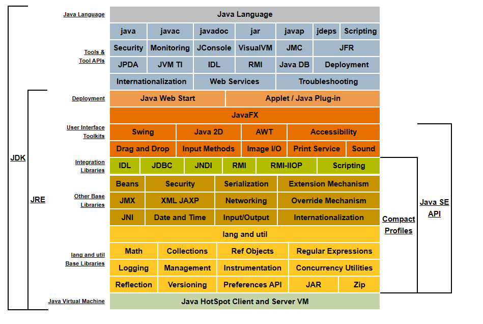

Oracle甲骨文有两款产品在Java SE: 
    Java SE Development Kit (JDK) 8 and Java SE Runtime Environment (JRE) 8.
JDK8是JRE8的一个超集。

1、JDK : Java Development ToolKit(Java开发工具包)。JDK是整个JAVA的核心，包括了Java运行环境（Java Runtime Envirnment），一堆Java工具（javac/java/jdb等）和Java基础的类库（即Java API 包括rt.jar）。

2、JDK是java开发工具包，在其安装目录下面有五个文件夹、一些描述文件、一个src压缩文件。bin、lib、 jre这四个文件夹起作用。可以看出来JDK包含JRE，而JRE包含JVM。

3、JDK是提供给Java开发人员使用的，其中包含了java的开发工具，也包括了JRE。所以安装了JDK，就不用在单独安装JRE了。