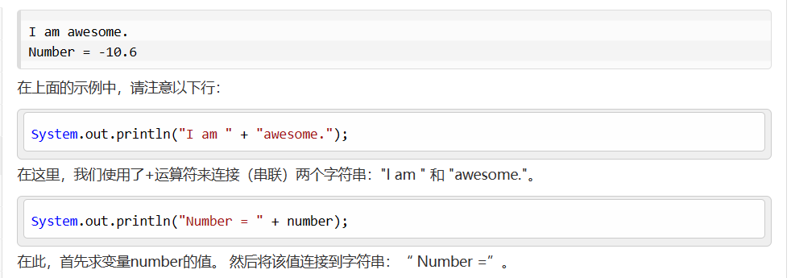
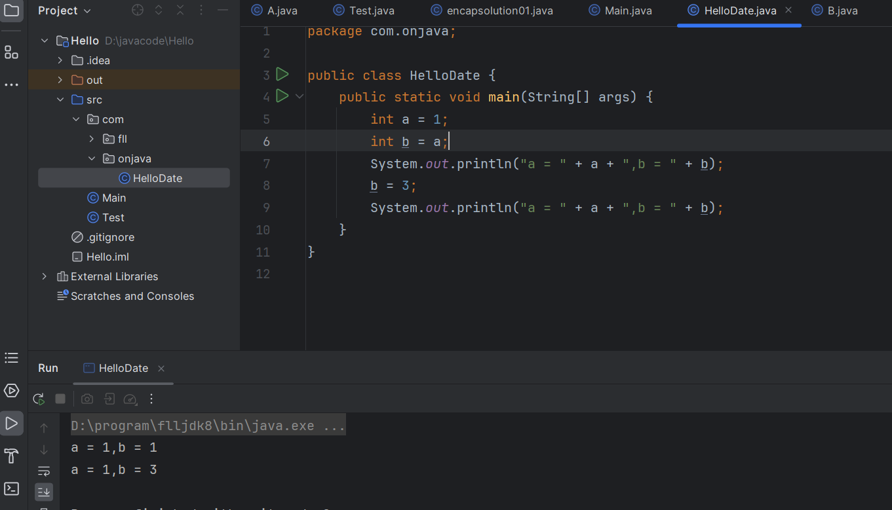
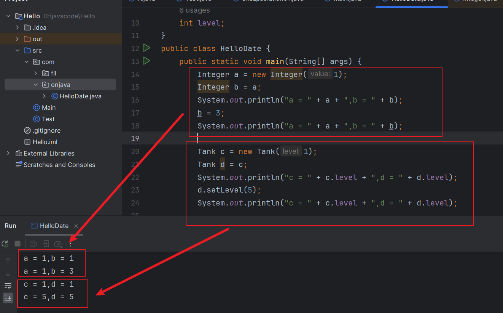
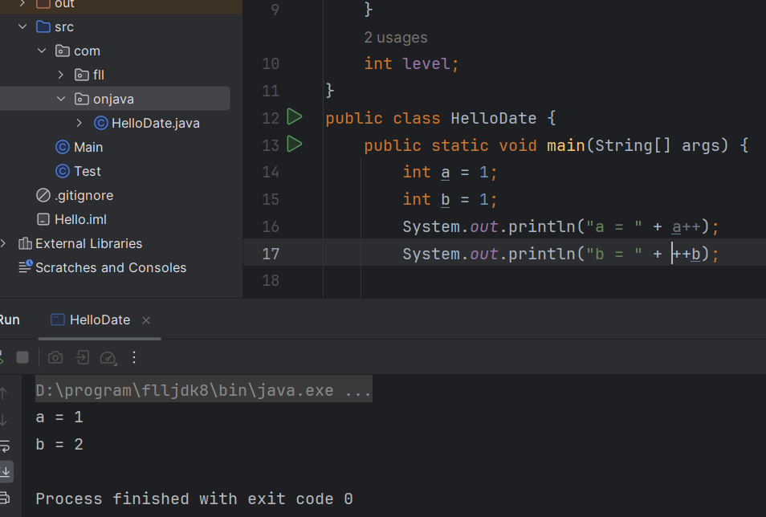

操作符的优先级：先乘除后加减，记不清最好用小括号

“+”意味着字符串的拼接，当编译器看到一个字符串后面紧跟着一个非String类型的元素时，会试图把它转换成String类型

赋值：取等号右边的值，把它赋值给等号左边。

基本类型存储了实际的值，而非对象的引用，所以在为其赋值时，你直接将一个地方的内容赋值到另一个地方。

a = b，就是将b的内容复制给a，如果你接着修改了a，b并不会收这个修改的影响。


不过在给对象赋值的时候，情况就发生了变化，当操作一个对象的时候，我们真正操作的是这个对象的引用。所以当一个对象复制给另一个对象的时候，你其实是将这个引用复制到另一个地方，这意味着，两个引用指向了同一个地方，当修改一个的时候，另一个也会发生变化。    \
但为什么我们Integer的引用没有发生变化，通过源代码我们发现，它被finnal关键字修饰，当被赋值时，会新建一个Integer覆盖，所以a,b已经不是同一个引用了。


所以，这种对象间的赋值通常又被称为别名。 \
方法调用中的别名，也会修改原来的对象，使用时需要注意。  \
不过，你可以使用 c.level = d.level 来实现，但这种直接操作对象的数据，违背了java的原则，在实际中最好不要使用。

算术操作符   \
* 加法(+)
* 减法(-)
* 乘法(*)
* 除法(/)
* 取模(%)
* 快速运算符，可以同时进行运算和赋值操作。如 x += 4

```
Random rand = new Random(47);//设置随机种子
i = rand.nextInt(100);   //生成一个上限为100的随机数，下限为0
j = rand.nextFloat();
k = rand.nextLong();
m = rand.nextDouble();

```

一元加操作符和一元减操作符   \
通常我们会使用一元加操作符进行数据类型转换，把字符串的值转换为数值类型的，当然你也可以使用Number进行转换，效果都是一样的，但是在写法上使用操作符会更简单。

自动递增和自动递减   \
* 前缀：先执行计算，然后返回生成的结果
* 后缀  先返回变量的值，然后再执行计算



在Java9以后，我们最好使用 Integer v1 Integer.valueOf(value)，来创建整数对象，已经弃用new Integer()了。

出于效率的原因，Integer会通过享元模式缓存范围在-128~127内的对象，因此多次调用这之间，生成的是同一个对象，而再次之外的值则不会这样，Integer通过equals()用来判断值相等。

逻辑操作符    \
与&&  或||  非！ \
在java中逻辑操作符只适用于布尔值

短路： \
一但表达式当前部分可以明确无误的确定整个表达式的值，表达式的剩余部分将不会被执行。

字面量：  \
```
int i1 = 0x2f;
int i2 = 0x2F;
int i3 = 0177;
byte b = 0x7f;
short s = 0x7fff;
long n1 = 200L;
long n2 = 200l;
long n3 = 200;
byte blb = (byte)0b00110101;
```
字面量的后缀表示了他的类型，大写的L表示long类型，大写（或小写）的字符F表示float类型，大写(或小写)的字符D表示double类型。
可以使用Integer和Long类的静态方法toBinaryString()可以表示该值的二进制形式。

可以在数字中添加下划线，是数字更加易读。

科学计数法
```
float expFloat = 1.39e-433f;
```

按位操作符
* 与&
* 或|
* 非~
* 异或^
可以和等号联合使用:  &=    |=   ^=

移位操作符
* 左移操作符（<<）           向左移动，右边补0
* 有符号的右移操作符（>>）    向右移动，符号为正，高位插0，否则插1
* 无符号的右移操作符（>>>）   无论符号为正为负，都在高位插0

三元操作符
boolean-exp ? value0 : value1

类型转换操作符

截尾和舍入
默认只有截尾操作，不过依然可以使用 Math.round(value) 来实现舍入

