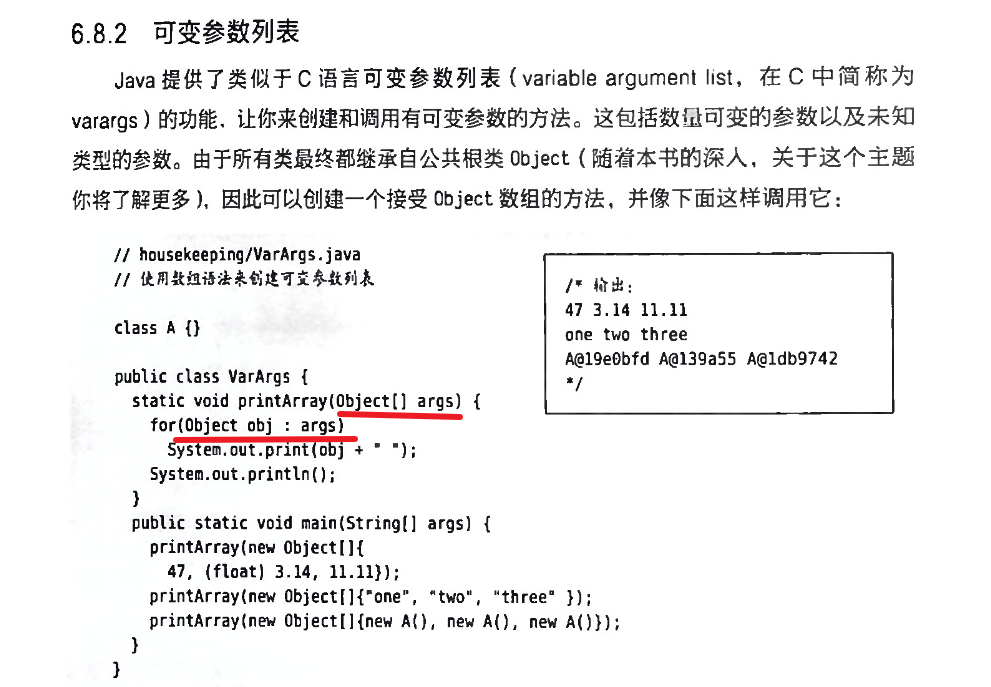

Java使用了构造器，在创建对象时被自动调用的特殊方法
同时还提供了一个垃圾收集器，当不在使用内存资源的时候，垃圾收集器会自动将其释放。

通过构造器来确保每个对象的初始化。
* 构造器的名字也就是类的名字
* 构造器是一种特殊的方法，它没有返回类型
* 无参构造器和有参构造器，如果你创建一个没有构造器的类，编译器会自动为这个类添加一个无参构造器，不过，如果你已经定义了一个构造器，无论是否有参数，编译器都不会帮你自动创建一个无参构造器了。


方法重载：
* 每个重载方法必须有独一无二的参数类型列表
* 基本数据类型可以从较小类型自动提升到较大类型，这个过程与重载相结合后可能会让人迷惑。
   如果传入的数据类型比方法参数的类型更宽，就必须使用窄化转型，否则会报错。

this关键字： \
对象调用方法时候，会有一个隐藏参数，也就是被操作对象的引用。this只能在非静态方法中使用，表示对象的引用，不过，如果从类的一个方法中调用另一个方法，那就没必要使用this，直接调用即可。不过，经常用在return语句中，来返回当前对象的引用。  \
this关键字还可以将当前对象传递给另一个方法（通常是不同类的）  \
this.s = s  可以对成员变量进行赋值

在构造器中调用构造器 \
在this后加了参数列表，就会显式调用与该参数列表匹配的构造器  \
普通方法是不能调用构造器的。

static关键字 

该方法没有this，不能从静态方法中调用非静态方法。

可以在没有创建对象的时候，直接通过类本身调用一个静态方法。

垃圾回收：
当垃圾回收器准备释放对象占用的资源时，它首先调用finalize()方法，并且只有在下一次垃圾收集时才会回收这个对象的内存。

C++中，所有对象都需要被销毁，如果对象时作为本地对象创建的，则销毁发生在创建对象的作用域的右花括号出，如果对象是new创建的，则调用C++操作符delete

相反，java不允许创建本地对象，你必须使用使用new，也没有释放对象的delete操作符，因为垃圾回收机制会自动释放存储空间。
但是如果JVM没有面临内存好近的情况，几乎不会浪费时间去执行垃圾回收机制来恢复内存。

成员初始化：
类的字段会被自动初始化，当在类中定义了一个对象引用而不将其初始化时，这个引用就会被赋予一个特殊值null
也可以指定初始化，在类中定义变量的分配值

使用构造器初始化
* 类中变量定义的顺序决定了初始化的顺序，即使分散到方法之间，变量定义仍然会在任何方法（包括构造器）调用之前被初始化。

无论创建了多少对象，静态数据都只有一份存储空间，static关键字不能用于局部变量，只能用于成员变量。
static初始化仅在第一个对象创建时被初始化，之后，这些静态对象不会被重新初始化。
初始化的顺序从静态字段开始，然后是非静态字段，
尽管没有显示使用static关键字，构造器也是静态方法

Java允许将多个静态初始化语句放在一个特殊的“静态子句”里
```
static int i;
static int j;
static{
    i=47;
    j=12
}
```
也是只执行一次。


非静态实例初始化：
创建对象时，会自动调用构造函数，对非静态实例初始化。


数组初始化：
要定义一个数组引用，在类型名字后面加上空方括号即可：

int[] al;       int al[];      两个效果是一样的

可以使用一种特殊的初始化表达式，即花括号来进行初始化

int[] al = {1,2,3,4,5};

a1.length可以获得数组的长度

int[] a2 = a1;
因为数组名是一个引用，直接赋值后，相当于别名，修改a2的元素值，a1也会修改。

动态数组创建：
int[] a = new int[rand.nextInt(20)]；

如果创建一个非基本类型数组，其实就是创建一个引用数组。比如包装类型Integer

Random rand = new Random();                  \
Integer[] a = new Integer[rand.nextInt(20)];                  \
Integer[] a = {1,2,3,};（1）                  \                          
Integer[] b = new Integer[]{1,2,3,}; （2）                 \
（1）只能用在定义数组的时候使用，（2）可以在任何地方使用，包括方法调用

可变参数列表

从java5开始，可以使用省略号来定义一个可变参数列表
```
static void printArray(Object... args){
    for(Object obj:args)
        System.out.println(obj + " ");
}
```
当使用省略号的时候，编译器会自动为你填充，你得到的仍然是一个数组。
getClass()方法是Object的一个方法，可以得到该元素的数据类型。


同时，可以使用自动装箱机制来匹配重载，然后调用具体的匹配方法。

枚举类型：

java5引入了enum机制
```
public enum Spiciness{
    NOT,MILD,MEDIUM,HOT,FLAMING
}
```
要使用enum，只需要创建一个该类型的引用，并将其分配给某给实例
* Spiciness howHOT = Spiciness.MEDIUM;
* toSting()方法，可以方便的显示enum的名字
* ordinal()方法，来表示特定enum的声明顺序
* values()方法，按照声明顺序生成一个enum常量值的数组
enum有一个很好的特性，就是可以在switch中使用

新特性：局部变量类型推断

编译器可以自动发现其类型，这就是类型推断，我们可以通过var关键字来启用它。


