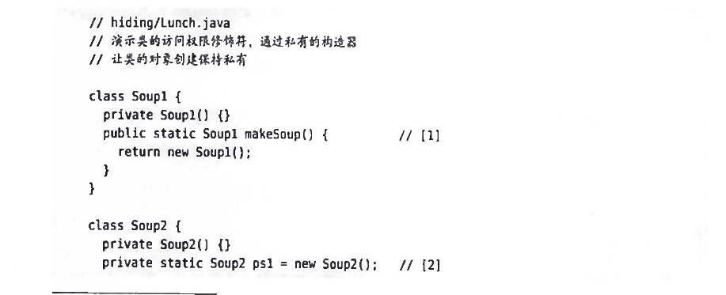
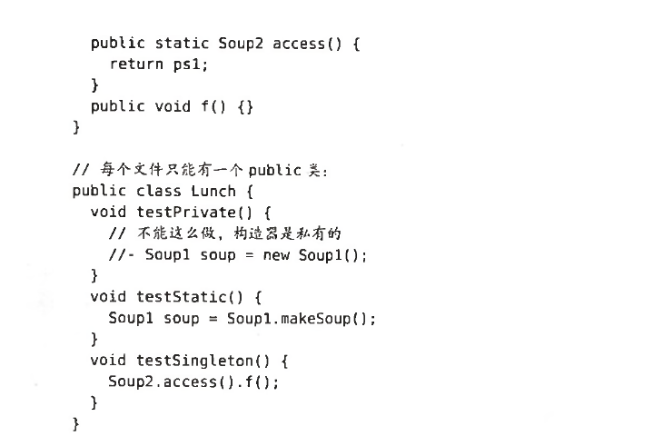

import java.util.*;

我们之所以要导入，是为了提供一种管理命名空间的机制。所有类成员的名字都是相互隔离的。

一个Java源文件就是一个编译单元，每个编译单元必须有一个.java结尾的文件名，在编译单元内，有且只有一个public类，它必须与文件同名。

当编译一个java文件时，文件的每个类都会有一个输出文件，以.class结尾。因此，你可以从少量的.java文件中获得相当多的.class文件。

在Java中一个可运行程序就是一堆.class文件，可以使用jar归纳器把它们打包并压缩成一个Java档案文件（JAR）。java解释器负责查找，加载和解释这些文件。

创建独一无二的包名：特定包下的所有.class文件放在同一个目录

package名称的第一部分是类创建者的反向的因特网域名，因为因特网域名是唯一的，如果你遵循了这个约定，你的package包也是唯一的。

classpath包含了一个或多个目录，用作查找.class文件的根目录，从根目录开始，解释器把包名里的每个点替换成斜杠，从而在classpath根目录生成一个路径名。

定制工具库：创建一个jar包，导入就可以使用其中的类。使用项目管理工具，如ant、maven、gradle等项目管理工具对软件进行添加jar包依赖，这是目前的主流方式，用项目管理工具发布后的软件在装了jre运行环境的主机上可以直接运行。

重构的主要动机之一，就是重写已经能正常工作的代码，提升其可读性，可理解性和可维护性。

java提供了访问控制符，来允许库开发者说明那些对客户程序员可用的，哪些是不可用的 

访问控制级别从最多访问到最少访问分别是
* public     任何地方都可以访问
* protected  继承，同时，protected还提供了包访问权限，同一包内的其他类也可以访问protected元素。
* 包内访问，没有关键字
* private

接口和实现

将接口和实现分离，客户程序员除了将消息发送到public接口之外什么都不能做。

类的访问权限：

只有两个权限：public访问权限和包访问权限

如果将构造器用private修饰，则不能创建该类的对象。

Soup1使用静态方法返回一个新对象

Soup2有且只有一个对象

JDK9引入了模块，Java库设计者现在可以将代码清晰的划分为模块，这些模块以编程的方式指定了它们所依赖的每个模块，并定义导出哪些组件以及哪些组件完全不可用。