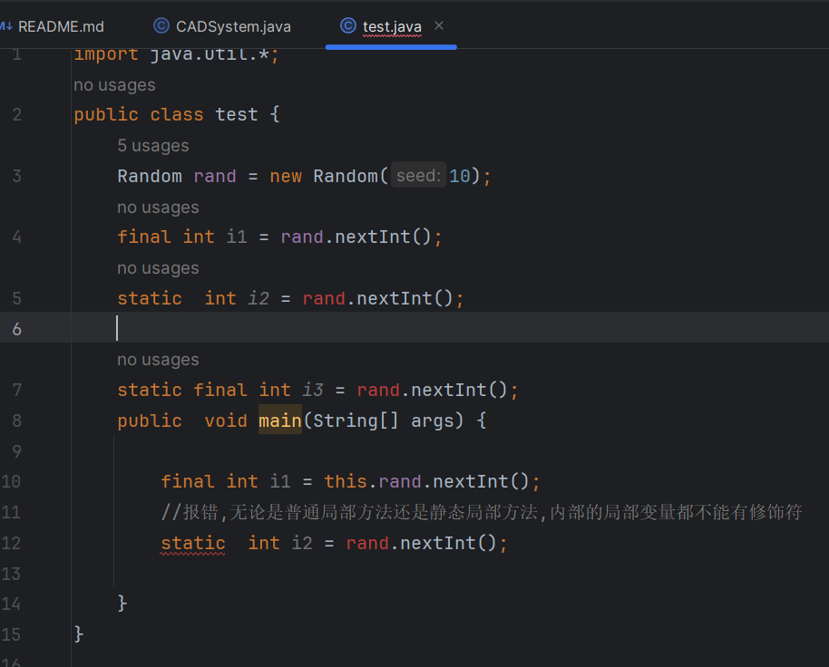
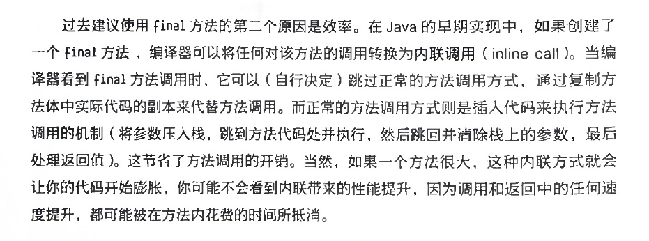
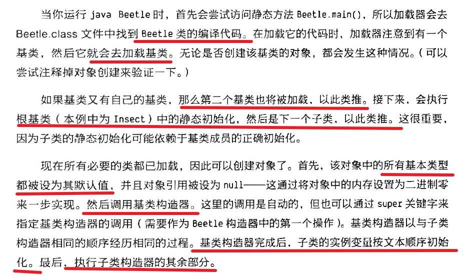

## @Override简单理解就是这个句话下边的方法是继承父类的方法，对其覆盖
@Override public String toString()  可以用来对新定义的类定义其println()打印。

println会去调用public void println(String x)，接着执行writeln(String.valueOf(x));具体看上面valueOf的源码，接着调用toString()方法，但是在String类中将toString()方法改写了，返回值是字符串本身。

## 组合
在新类中创建现有类的对象
## 继承
直接复制了现有类的形式，然后向其添加代码，而没有修改现有类。

创建一个类时，除非明确指定了要继承某个类，否则将隐式继承Java的标准根类Object.

extends关键字

可以为每个类都创建一个main()方法，来进行简单的测试，当测试完成后，也不需要删除main(),可以将其保留以供后续测试。
即使一个程序中有很多类，唯一运行的main()也只会是命令行中调用的那个。

* Java提供了super关键字，来指代当前类继承的基类。
* 在继承时，并不局限于只使用基类的方法，还可以向子类中添加新方法。
* 在子类构造器中调用基类构造器来执行初始化，它具有执行基类初始化所需的全部信息和权限。Java会自动在子类构造器中插入对基类构造器的调用。\
  构造过程是从基类向外进行的。如果你必须调用具有参数的基类构造器，那么就要使用super关键字和相应的参数列表。

## 委托
将成员对象放在正在构建的类中，接受请求的对象将请求委托给另一个对象来处理。

## 组合和继承相结合以及如何选择组合还是继承。
* 继承是用来表示“is-a”关系的，组合是用来表示“has-a”关系的
* 只有当继承能发挥显著优势时，才应该谨慎的使用它。确定使用组合还是继承最清晰的方法之一，就是询问是否需要向上转型。

## 确保正确的清理
* try关键字表示后面的代码块是一个保护区域，无论try代码块如何退出，该保护区域之后的finally子句始终都会执行。
* 首先执行自己的类的所有清理构造，其顺序同创建顺序相反，然后调用基类的清理工作。

## 名称隐藏
如果Java基类的方法被多次重载，则在子类中重新定义该方法名称不会隐藏任何基类版本。

@Override注解，当你打算重写一个方法时，可以选择添加这个注解，如果不小心对方法进行了重载而不是重写，编译器就会报错。

## 向上转型
向上转型总是安全的，因为你可以从更具体的类型转为更通用的类型

## final关键字
* final数据：
常量是一个编译时变量，编译器可以将常量值“折叠”到计算中.

一个既是static又是final的字段只会分配一块不能改变的存储空间。（按照惯例，需要全部使用大写字母命名，单词之间用下划线分隔）。
static强调只有一个，final表示它是一个常量。

final关键字和对象引用而非基本类型一起使用时，一但引用被初始化为一个对象，它就永远不能更改为指向另一个对象。
但是对象本身是可以更改的。

* 空白final
空白final是没有初始化的final字段，编译器会确保在使用前初始化这个空白final字段，在构造器中初始化，就可以保证每个对象有不同的final字段，同时还保证了其不可更改的特征。
* final参数
可以通过参数列表中进行声明来创建final参数，这意味着在方法内部不能更改参数引用指向的内容
* final方法
防止继承类通过重写改变该方法的含义。

效率高。

* private和final
如果尝试重写private方法，似乎是可以的，编译器也不会报错，使用final可以很好的解决这个问题。

## final类

## 初始化及类的加载
Java里一切都是对象，每个类的编译代码都存在于自己的单独文件中，只有在需要它的代码的时候才会加载该文件。

