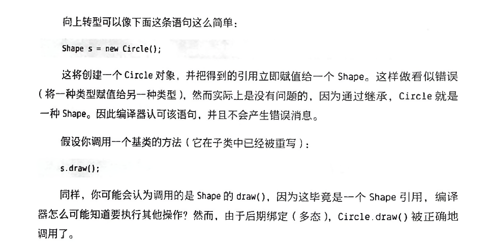

多态提供了另一个维度得接口与实现的分离，将做什么与怎么做解耦。

## 方法调用和绑定
将一个方法调用和一个方法体关联起来的动作称为绑定。
在程序运行之前执行绑定，称为前期绑定
绑定发生在运行时，并基于对象的类型，称为后期绑定，或动态绑定，运行时绑定。

Java中所有方法绑定都是后期绑定，除了static和final方法。

多态是程序员"将变化的事物与不变的事物分离"的一项重要技术。

private方法自动就是final的，并且对子类是隐藏的，所以如果在子类重写的方法是一个全新的方法，它甚至没有重载。

只有非private方法可以被重写，但是注意重写private方法的假象，它不会产生编译器警告，但也不会执行你可能期望的操作，所以为了清楚起见，请在子类中使用与基类private方法不同的名称。

如果使用了@override注解，那么这个问题就会被检测出来。

我们一般不会为基类字段和子类字段指定相同的名称，因为这会造成混淆。

静态方法与类相关联，而不是与某个对象相关联。

### 构造器和多态
只有基类构造器具有足够的信息和权限来初始化它自己的成员，因此，必须调用所有的构造器；否则，将无法正确构造整个对象。
如果你没有在子类的构造器代码显示调用基类构造器，它将隐式调用基类的无参构造器。如果没有无参构造器，编译器会报错。

### 协变返回类型
子类中重写方法的返回值可以是基类方法返回值的子类型

### 用继承进行设计
千万不能所有类都来继承。更好的方法是先选择组合，因为组合更加灵活，可以动态的选择类型。

使用继承来表达行为上的差异，使用组合来表达状态上的变化。

因为向上转型会丢失特定类型的信息，所以我们自然就可以通过向下转型重新获取这些类型信息。

在Java中，每个转型都会被检查！因此，即使看起来只是在执行一个普通的带括号的强制转型，但在运行时会检查此强制转型，以确保它实际上是你期望的类型。

