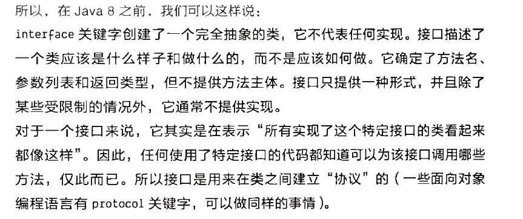
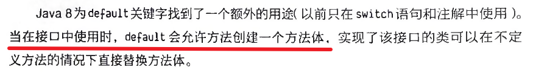
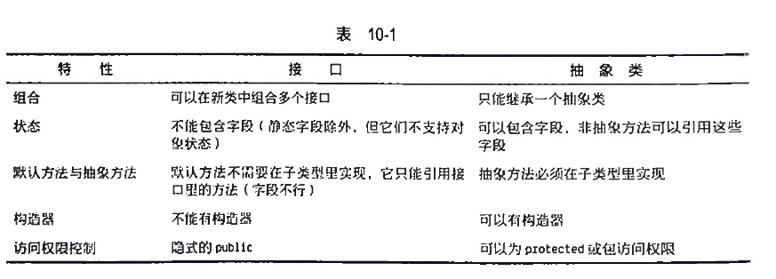
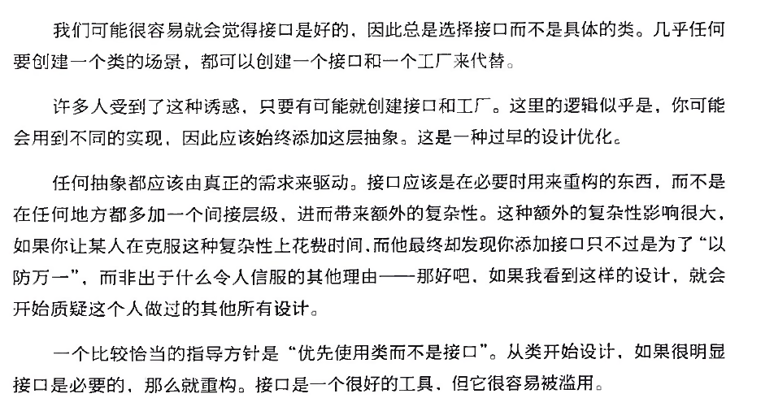

### 抽象方法和抽象类
Java提供了抽象方法的机制，它只有一个声明，没有方法体。
```
abstract void f();
```
包含抽象方法的类称为抽象类。
```
abstract class Basic{

}

```
如果一个新类型继承了抽象类，并希望生成自己的对象，那它必须为基类中的所有抽象方法提供方法定义。
如果不这样做，那么子类也是抽象的，编译器将强制你使用abstract关键字来限定这个子类。

一个抽象类可以不包含任何抽象方法，如果一个类并不需要包含抽象方法，但同时还想阻止它的任何实例化，这时将其定义为抽象类就很有用了。

默认的访问权限是包访问权限，但接口自动将其方法设为了public。

### 接口

要创建接口，请使用interface关键字而不是class关键字。
接口也可以包含字段，但这些字段是隐式的static和final。

要创建一个符合特定接口的类，请使用implements关键字，用来实现接口定义。
除此之外，它看起来更像继承。

### 默认方法






### 组合多个接口
可以使用继承轻松地向接口里添加新的方法声明，也可以通过继承将多个接口组合成一个新接口。

### 适配接口
引入接口，可以允许同一接口有多个实现。

接口中的任何字段都是static和final的，请注意，Java里具有常量初始值的static final字段命名全部使用大写字母，下划线分隔。

### 嵌套接口
接口可以嵌套在类和其他接口中

### 接口和工厂

### 接口的private方法
jdk9之后不再需要default关键字，因为变成private后自动就是default的了。

### 新特性：密封类和密封接口
JDK17之后：
sealed class Base permits D1,D2{

}



