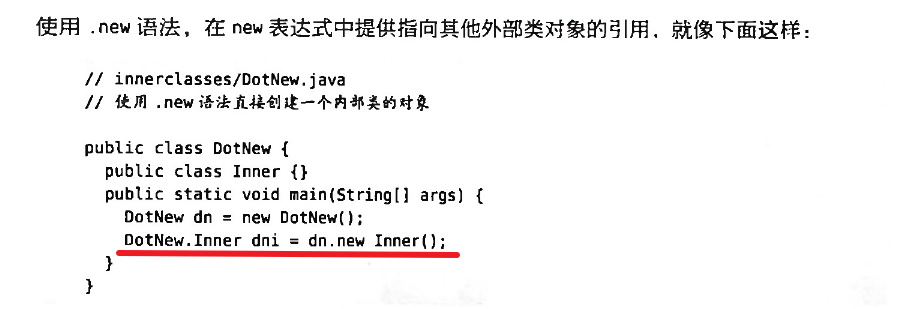

创建内部类的方式就是把类定义放在一个包围它的类之中。

更多的是，外部类有一个方法，该方法返回一个指向内部类的引用

要在外部类的非静态方法之外的任何地方创建内部类的对象，必须将对象类型指定为OuterClassName.InnerClasssName

## 到外部类的链接
内部类会隐含一个链接，指向用于创建该对象的外围对象，通过该链接，内部类对象就可以访问外围对象的成员。

## 使用.this和.new
要生成外部类对象的引用，可以使用外部类的名字，后面加上句点和this

有时我们想让其他某个对象来创建它的某个内部类的对象，可以使用.new语法，在new表达式中提供指向其他外部类对象的引用。

## 内部类和向上转型

## 在方法和作用域中使用内部类

## 匿名内部类

## 嵌套类

## 继承内部类

