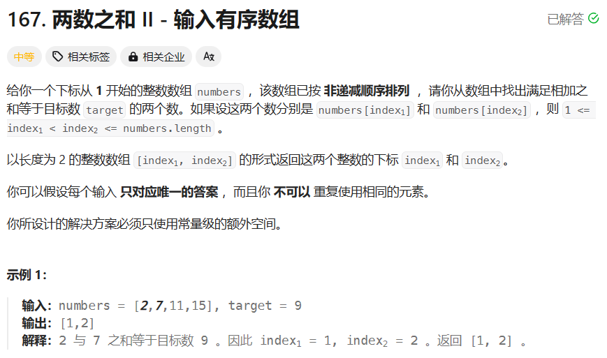
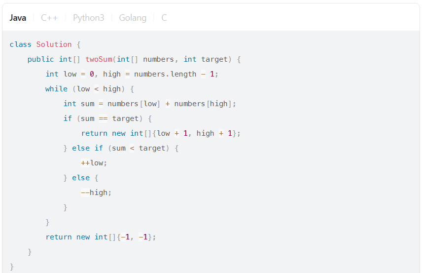
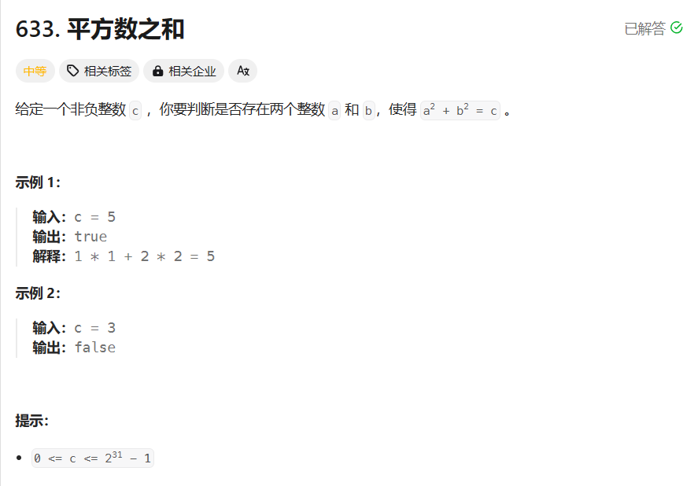
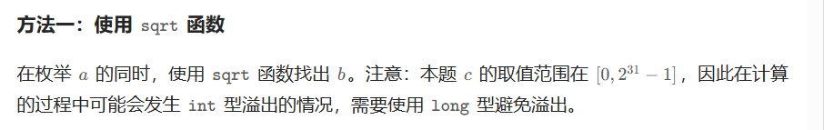
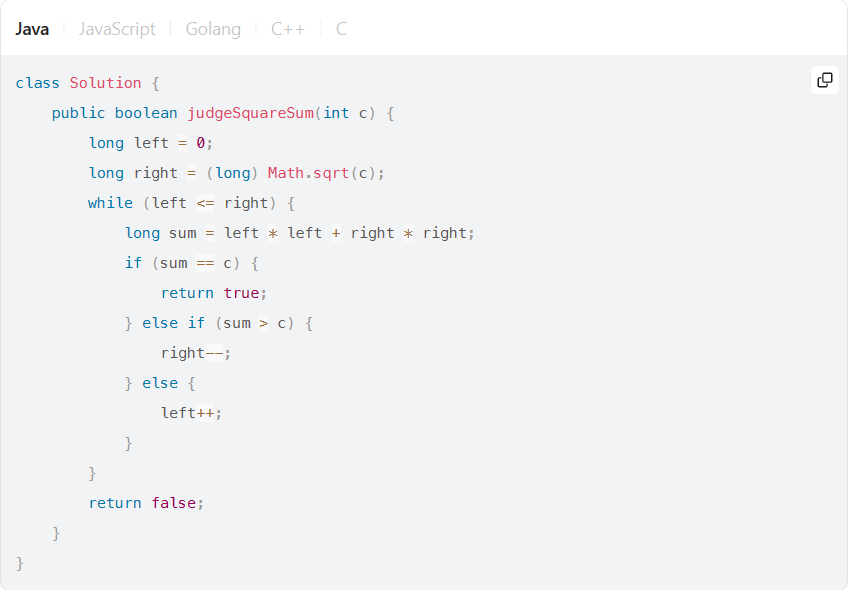
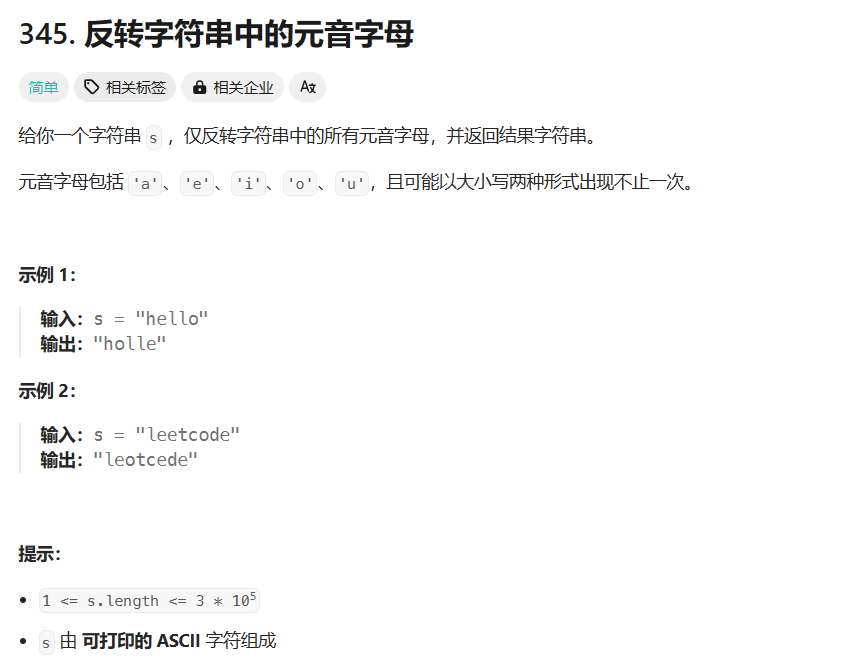
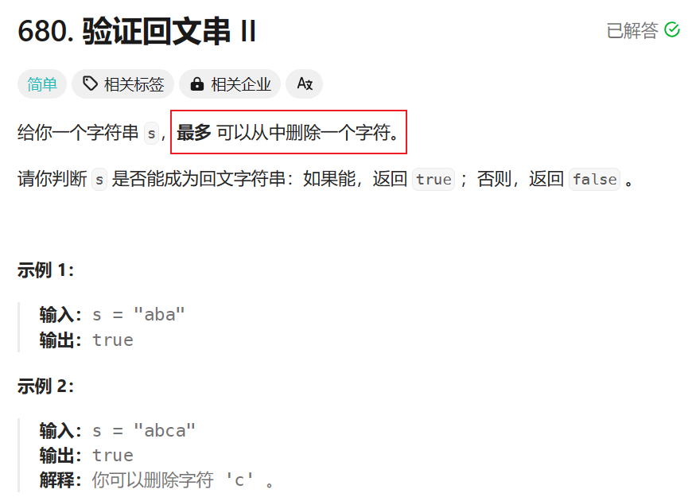

## 注意溢出问题






```
class Solution {
    //画图，好理解点
    public String reverseVowels(String s) {
        //字符串的长度
        int len = s.length();
        //将字符串转为字符数组，原因字符串是不可变的
        char[] chars = s.toCharArray();
        //左指针，指向字符串的首字母
        int i = 0;
        //右指针，指向字符串的末尾字符
        int j = len-1;
        //只要左指针小于右指针，就进入循环
        while(i < j){
            //左指针从左向右遍历，
            //并判断下遍历的每一个字符是否是元音字符，不是就继续移动
            while(i < len && !isVowel(chars[i])){
                i++;
            }
            //右指针从右向左遍历，
            //并判断遍历的每一个字符是否有元音，不是就继续移动
            while(j > 0&& !isVowel(chars[j])){
                j--;
            }
            //此时左右指针都停在了元音字符的位置，
            if(i<j){
                //将两个字符的位置进交换
                swap(chars, i, j);
                //并同时将两个指针向右和向左移动
                i++;
                j--;
            }
        }
        //将字符数组转为字符串输出
        return new String(chars);
    }
    //判断是否是元音字符
    public boolean isVowel(char ch){
        //调用方法，判断这个字符在这个字符串里面的下标，
        //如果存在，就返回该字符的第一次出现的下标，如果不存在，就返回-1
        return "aeiouAEIOU".indexOf(ch) >= 0;
    }
    //交换两个字符的位置
    public void swap(char[] chars, int i, int j){
        char temp = chars[i];
        chars[i] = chars[j];
        chars[j] = temp;
    }
}
```



## 本题的关键是可以删除一个字符。
```
class Solution {
    public boolean validPalindrome(String s) {
        int low = 0, high = s.length() - 1;
        while (low < high) {
            char c1 = s.charAt(low), c2 = s.charAt(high);
            if (c1 == c2) {
                ++low;
                --high;
            } else {
                return validPalindrome(s, low, high - 1) || validPalindrome(s, low + 1, high);
            }
        }
        return true;
    }

    public boolean validPalindrome(String s, int low, int high) {
        for (int i = low, j = high; i < j; ++i, --j) {
            char c1 = s.charAt(i), c2 = s.charAt(j);
            if (c1 != c2) {
                return false;
            }
        }
        return true;
    }
}
```
