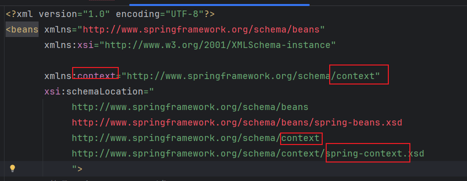
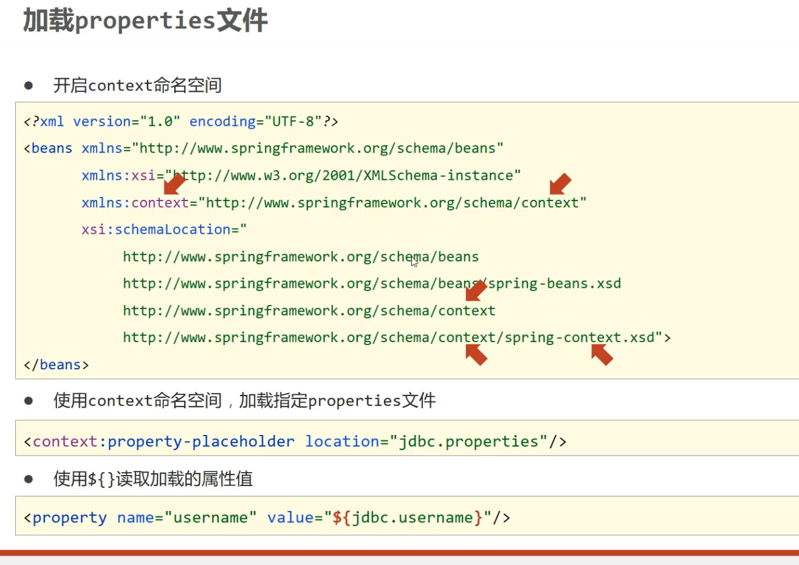
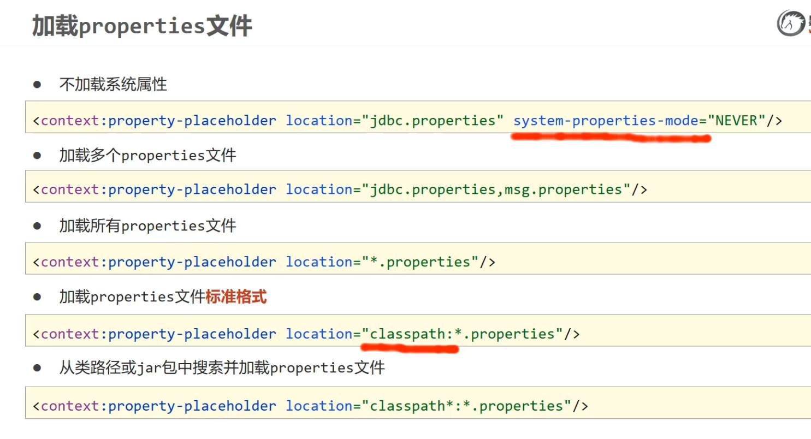

```
    <!--classpath*:*.properties  ：  设置加载当前工程类路径和当前工程所依赖的所有jar包中的所有properties文件-->
    <context:property-placeholder location="classpath*:*.properties" system-properties-mode="NEVER"/>
    system-properties-mode="NEVER":不加载系统属性
```

