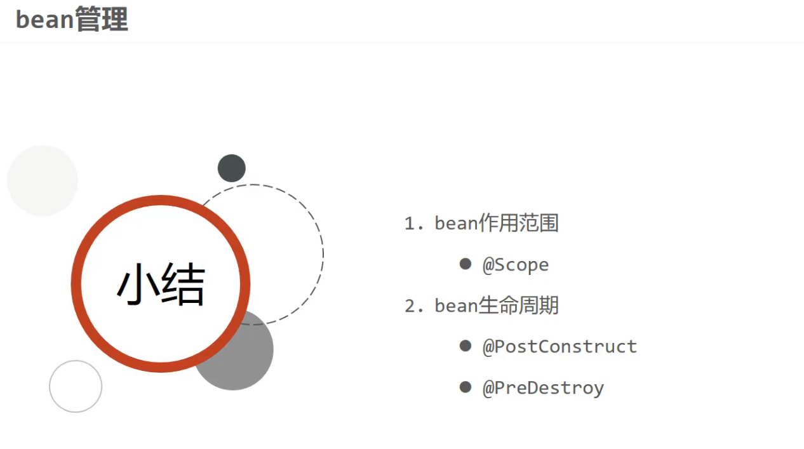

```
@Repository 
@Scope设置bean的作用范围
@Scope("singleton")
@Scope("prototype")
public class BookDaoImpl implements BookDao {

    public void save() {
        System.out.println("book dao save ...");
    }
    //@PostConstruct设置bean的初始化方法
    @PostConstruct
    public void init() {
        System.out.println("init ...");
    }
    //@PreDestroy设置bean的销毁方法
    @PreDestroy
    public void destroy() {
        System.out.println("destroy ...");
    }

}

```
