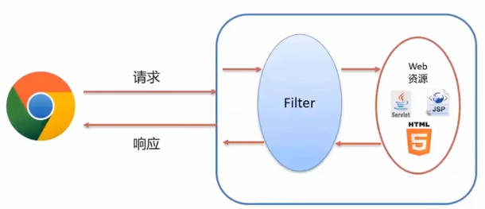
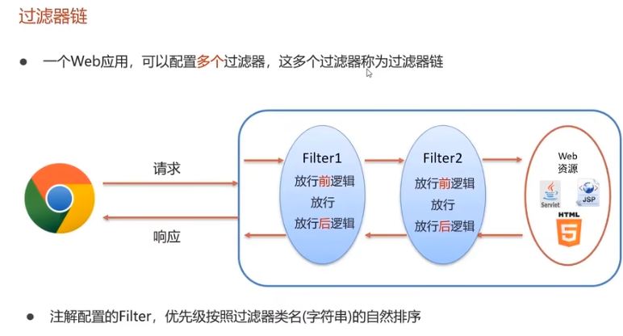

# Filter
- 概念：Filter表示过滤器，是JavaWeb三大组件(Servlet、Filter、Listener)之一
- 过滤器可以把对资源的请求拦截下来，从而实现一些特殊的功能。
- 过滤器一般完成一些通用的操作，比如：权限控制，用户登录，统一编码处理，敏感字符处理等等。


```
    public void doFilter(ServletRequest servletRequest, ServletResponse servletResponse, FilterChain filterChain) throws IOException, ServletException {
        //放行前的逻辑
        System.out.println("Before Filter");

        //放行
        filterChain.doFilter(servletRequest,servletResponse);

        //放行后的逻辑
        System.out.println("After Filter");
    }
```

# 过滤器链
