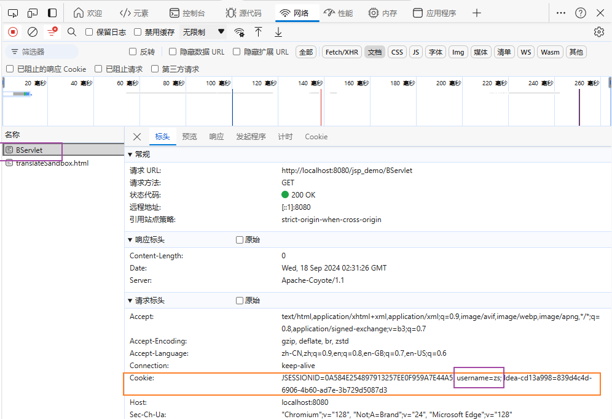

会话跟踪技术就是用来解决一次会话中多次请求之间数据共享的问题

Cookie: 客户端会话技术，将数据保存到客户端，以后每次请求都携带Cookie数据进行访问

发送Cookie:
1. 创建Cookie对象，设置数据
   Cookie cookie = new Cookie("key","value");
2. 发送Cookie到客户端：使用response对象
    response.addCookie(cookie);

获取Cookie
1. 获取客户端携带的所有cookie，使用request对象
Cookie[] cookies = request.getCookies();
2. 遍历数组，获取每一个cookie

3. 使用cookie对象方法获取数据
cookie.getName();
cookie.getValue();

Cookie原理:

Cookie使用细节：
- Cookie存活时间：
  - 默认情况下，Cookie存储在浏览器内存中，当浏览器关闭，内存释放，则Cookie被销毁。
  - setMaxAge(int seconds): 设置Cookie存活时间
    1. 正数：将Cookie写入浏览器所在电脑的硬盘，持久化存储，到时间自动删除
    2. 负数：默认值，Cookie存储在浏览器内存中，当浏览器关闭，内存释放，则Cookie被销毁。
    3. 零：删除对应Cookie

Cookie存储中文：
- Cookie不能直接存储中文
- 如需要存储，则需要进行转码：URL编码
  - username = URLEncoder.encode(username, "UTF-8");
  - value = URLDecoder.decode(value, "UTF-8");
