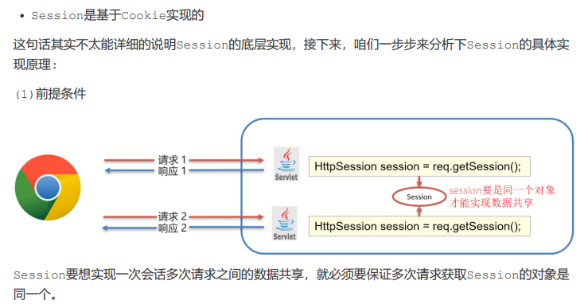
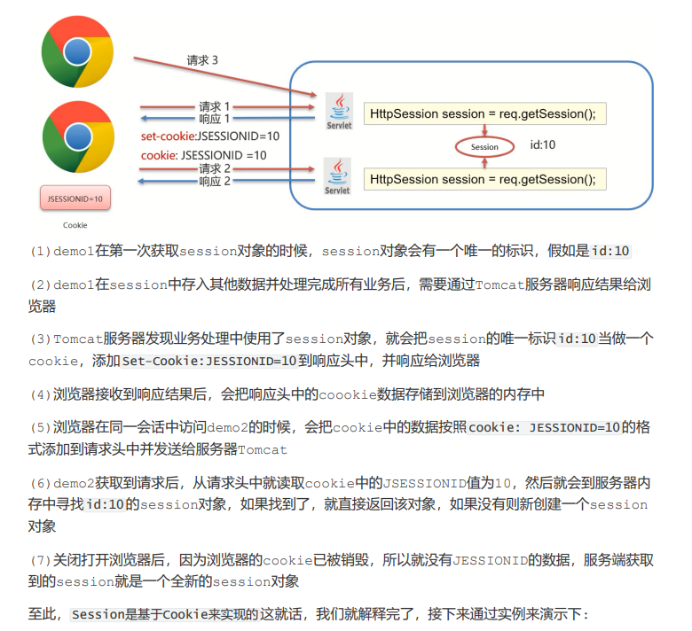
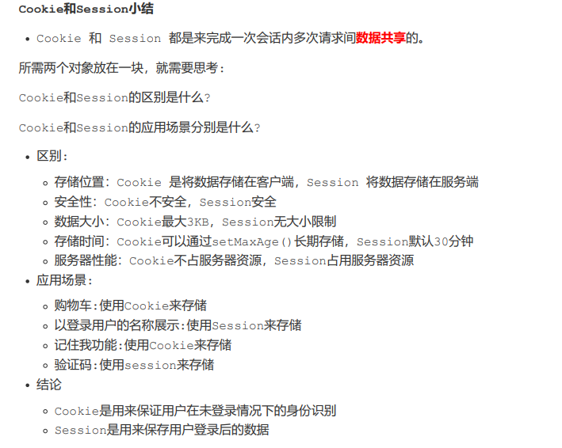

# Session
- 服务端会话跟踪技术：将数据保存到服务端
- JavaEE提供HttpSession接口，来实现一次会话的多次请求间数据共享功能
- 使用
  - 1. 获取Session对象
      - HttpSession session = request.getSession();
  - 2. Session对象功能
      - void setAttribute(String name,Object o): 存储对象到session域中
      - Object getAttribute(String name): 根据key，获取值
      - void removeAttribute(String name): 根据key,删除该键值对

Session是基于Cookie实现的

Session使用细节：
1. Session 钝化、活化：
    服务器重启后，Session中的数据是否还在？
        钝化：在服务器正常关闭后，Tomcat会自动将Session数据写入硬盘的文件中
        活化：再次启动服务器后，从文件中加载数据到Session中
2. Session销毁
   - 默认情况下，无操作，30分钟自动销毁，可以在web.xml中配置
        <session-config>
            <session-timeout>100</session-timeout>
        </session-config>
    如果没有配置，默认是30分钟，默认值是在Tomcat的web.xml配置文件中写死的
   - 调用Session对象的invalidate()进行销毁

