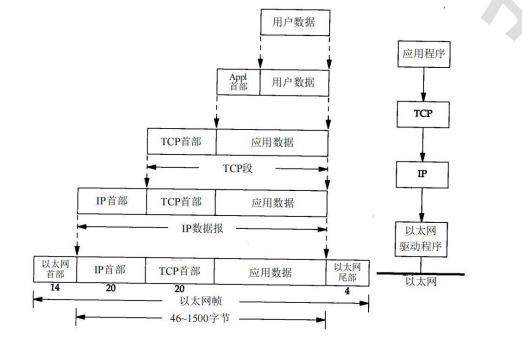
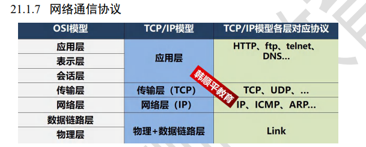
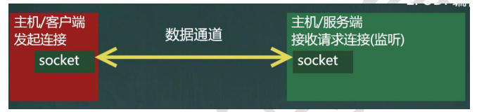
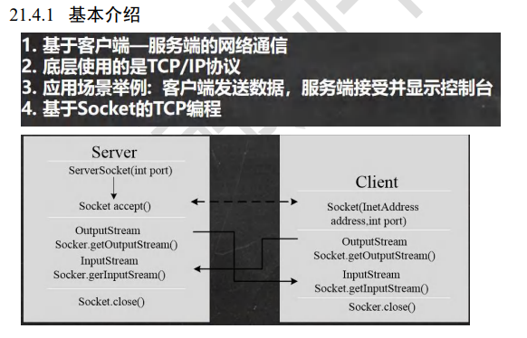

java.net包下提供了一系列的类和接口，完成网络通信

网络
1. 概念：两台或多台设备通过一定物理设备连接起来构成了网络
2. 根据网络的覆盖范围不同对网络进行分类
   1. 局域网：覆盖范围最小，仅仅覆盖一个教室或一个机房
   2. 城域网：覆盖范围较大，可以覆盖一个城市
   3. 广域网：覆盖范围最大，可以覆盖全国，甚至全球，万维网就是广域网的代表

ip地址:
1. 用于唯一标识网络中的每台计算机/主机
2. 查看ip地址：ipconfig
3. ip地址的表示形式：点分十进制
4. 每个十进制的范围：0~255
5. IP地址的组成 = 网络地址 + 主机地址
6. ipv6是用于替代ipv4的下一代ip协议，其地址数量号称可以为全世界的每一粒沙子编上一个地址
7. 由于ipv4最大的问题在于网络地址资源有限，严重制约了互联网的应用和发展。ipv6的使用，不仅能解决网络地址资源数量的问题，而且也解决了多种设备炼乳互联网的障碍。

域名：
1. www.baidu.com
2. 好处：为了方便记忆，解决ip记忆困难的问题
3. 概念：将ip地址映射为域名

端口号：
1. 概念：用于标识计算机上某个特定的网络程序
2. 表示形式：0~65535[2个字节表示端口号 0~2^16-1]
3. 0~1024已经被占用
4. 常见的网络程序端口号：
   1. tomcat:8080
   2. mysql:3306
   3. oracle:1521
   4. sqlserver:1433

网络通信协议：
TCP/IP
中文译名传输控制协议/因特网互联协议，又叫网络通信协议，这个协议是Internet最基本的协议，Internet国际互联网络的基础，简单地说，就是有网络层的IP协议和传输层的TCP协议组成的。

TCP:
1. 使用TCP协议前，须先建立TCP连接，形成传输数据通道
2. 传输前，采用“三次握手”方式，是可靠的
3. TCP协议进行通信的两个应用进程：客户端、服务器
4. 在连接中可进行大数据量的传输
5. 传输完毕，需释放已建立的连接，效率低

UDP协议：
1. 将数据、源、目的封装成数据包，不需要建立连接
2. 每个数据包的大小限制在64k内
3. 因无需连接，故是不可靠的
4. 发送数据结束无需释放资源（因为不是面向连接的），速度快
5. 距离：发短信

InetAddress类：
1. 获取本机InetAddress对象 getLocalHost
2. 根据指定主机名/域名获取ip地址对象 getByName
3. 获取InetAddress对象的主机名 getHostName
4. 获取InetAddress对象的地址 getHostAddress

Socket:
1. 套接字(Socket)开发网络应用程序被广泛采用
2. 通信的两端都有Socket，是两台机器间通信的端点
3. 网络通信其实就是Socket间的通信
4. Socket允许程序把网络连接当成一个流，数据在两个Socket间通过IO传输
5. 一般主动发起通信的应用程序称为客户端，等待通信请求的为服务端

# TCP网络通信

