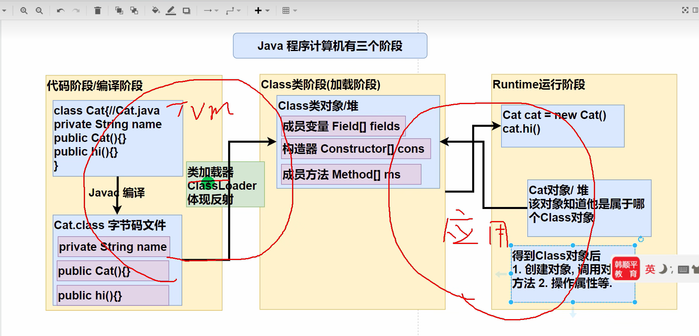
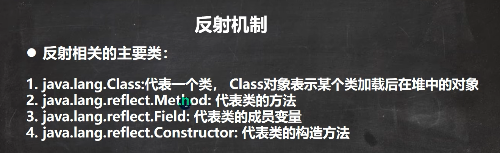

通过外部文件配置，在不修改源码的情况下，来控制程序。
也符合设计模式的ocp原则（开闭原则：不修改源码，扩容功能）

Java Reflection:
- 1. 反射机制允许程序在执行期借助于Reflection API 取得任何类的内部信息(如成员变量，构造器，成员方法等等)
     并能操作对象的属性及方法。反射机制在设计模式和框架底层都会用到
- 2. 加载完类之后，在堆中就产生了一个Class类型的对象（一个类只有一个Class对象），这个对象包含了类的完整结构信息。
     通过这个对象得到类的结构。这个对象就像一面镜子，透过这个镜子看到类的结构，所以，形象的称之为反射

反射机制可以完成
1. 在运行时判断任意一个对象所属的类
2. 在运行时构造任意一个对象
3. 在运行时得到任意一个类所具有的成员变量和方法
4. 在运行时调用任意一个对象的成员变量和方法
5. 生成动态代理

这些类在  java.lang.reflect
