torch包包含多维张量的数据结构，并定义这些张量上的数学运算。

此外，它还提供了许多实用程序，用于张量和任意类型的高效序列化，以及其他有用的实用程序。

tensor 分为头信息区(Tensor)和存储区(Storage)。

信息区(Tensor)主要存储tensor的形状(size)、步长(stride)、数据类型(type)等信息，其真正的数据保存为连续数组，存储在存储区(Storage)中。

一般来说pytorch中tensor的数据很大，可能是成千上万的，所以我们信息区(Tensor)一般来说占用的内存比较少，主要内存的占用取决于tensor中元素的数目，也就是存储区(Storage)的大小。
```

import torch

a = torch.rand(3, 5)
print(a)
# a.storage()将被丢弃，a.untyped_storage()来代替。
print(a.storage())
b = a.untyped_storage()
print(a.is)
tensor([[0.5572, 0.2308, 0.5311, 0.5901, 0.9444],
        [0.0053, 0.3987, 0.5092, 0.5241, 0.8213],
        [0.7216, 0.4833, 0.9023, 0.6109, 0.1553]])

 0.5572177171707153
 0.23083359003067017
 0.5311199426651001
 0.5900749564170837
 0.944441556930542
 0.00533062219619751
 0.39870399236679077
 0.5092213749885559
 0.5241267085075378
 0.8212704062461853
 0.7215670943260193
 0.4833354949951172
 0.9022901654243469
 0.6109415888786316
 0.1552547812461853
[torch.storage.TypedStorage(dtype=torch.float32, device=cpu) of size 15]
```
## Tensors
is_tensor()  :obj是否为tensor

is_storage() :obj是否为storage

is_floating_point(): obj是否是float类型，
one of torch.float64, torch.float32, torch.float16, and torch.bfloat16

is_nonzero(): 如果input只有一个元素且不为0则返回true

set_default_dtype():  设置默认的类型

get_default_dtype():  得到默认的类型

set_default_device(): 设置默认的device

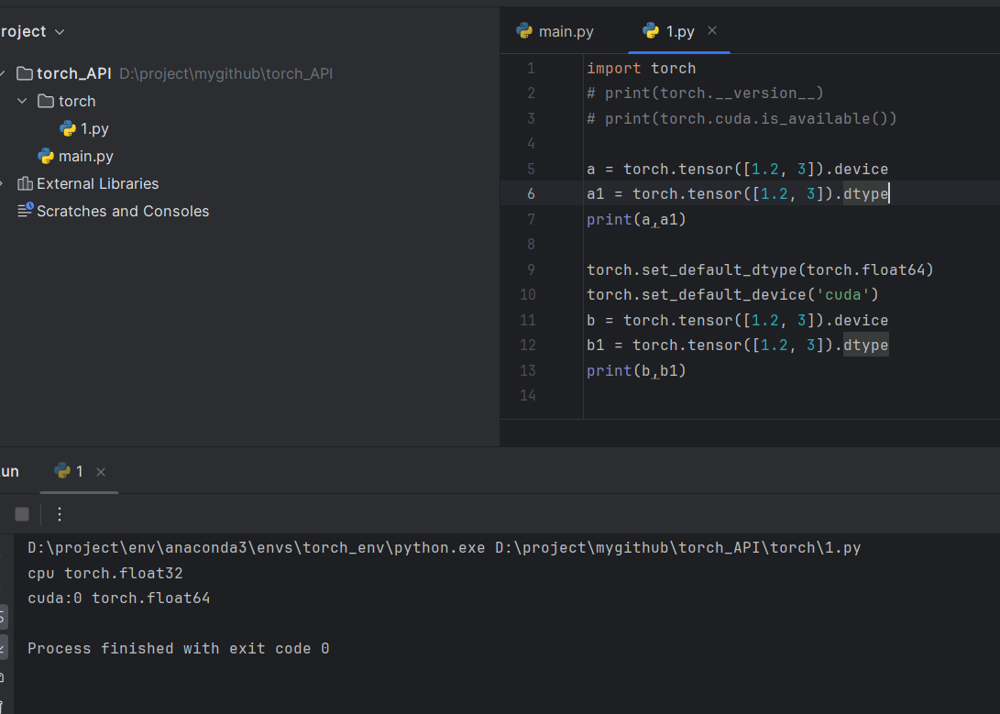

numel(): 返回输入张量的元素个数

set_printoptions(): 设置打印格式，可以设置精度，等等吧

## Creation Ops
tensor(): 创建一个张量

创建一个稀疏矩阵：
* sparse_coo_tensor
* sparse_csr_tensor
* sparse_csc_tensor
* sparse_bsr_tensor
* sparse_bsc_tensor


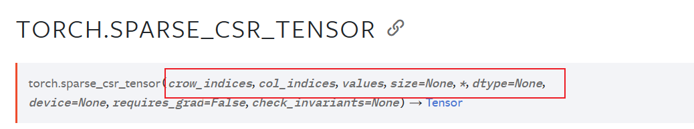

将一个对象转为一个tensor，copy=True，则复制一份，否则共享内存。
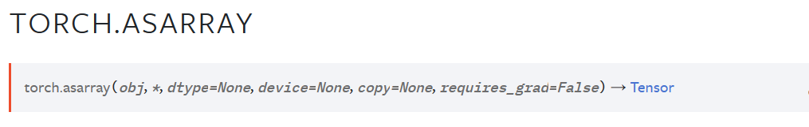


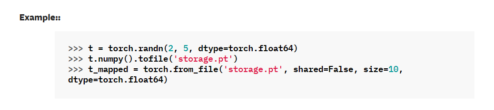

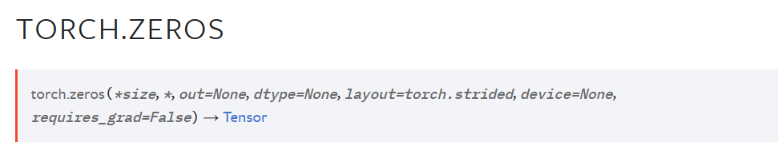


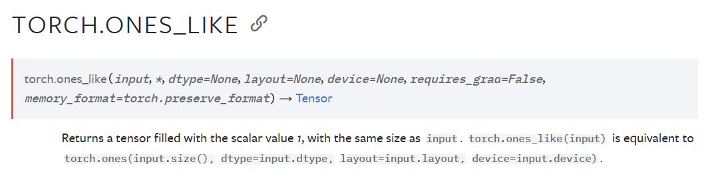


多了一个base参数
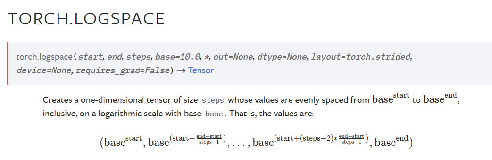
返回一个单位矩阵

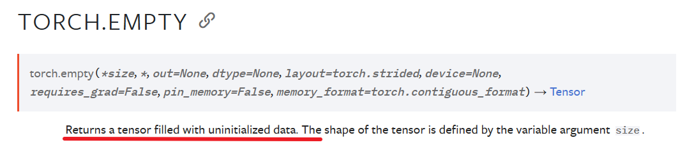


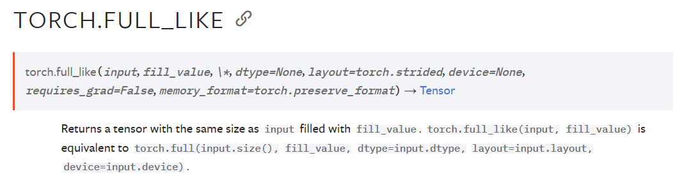

## Indexing, Slicing, Joining, Mutating Ops

argwhere(): 返回非零元素的索引

cat(): 组合输入的张量，所有的张量应该在期望的维度上有相同的尺寸。

concat()，concatenate()是cat()的一个别名

split(): 切分张量
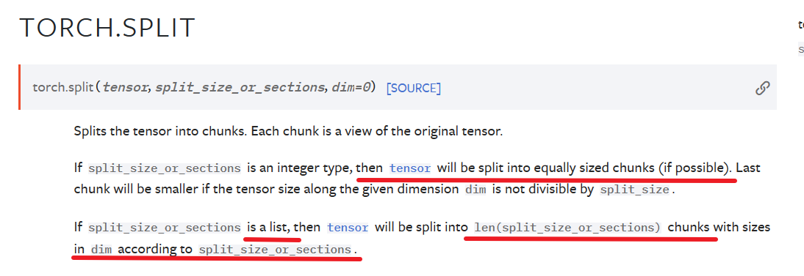
chunk(): 维度除分块数--->向上取整
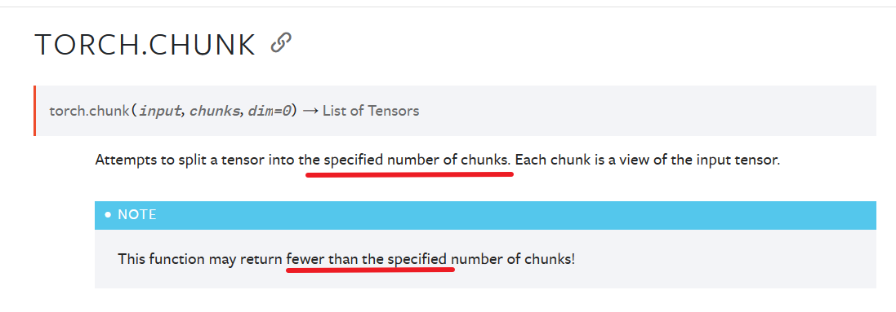
column_stack():在列上进行堆叠

* dsplit():
* dstack():
* hsplit():
* hstack():

permuted(): 返回一个input维度转换后的视图。
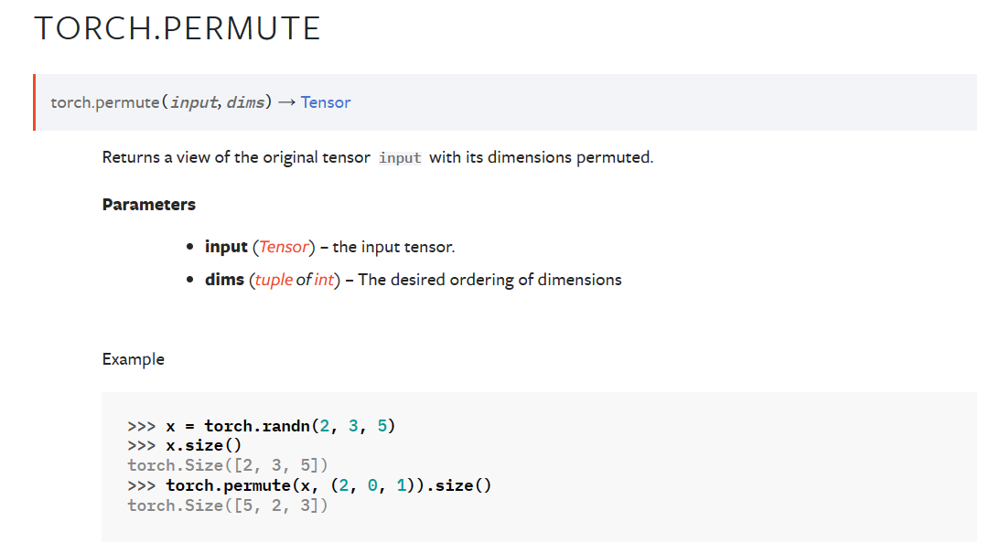
reshape():

* split():
* stack():
* vsplit():
* vstack()

squeeze(): 删除尺寸为1的维度并返回
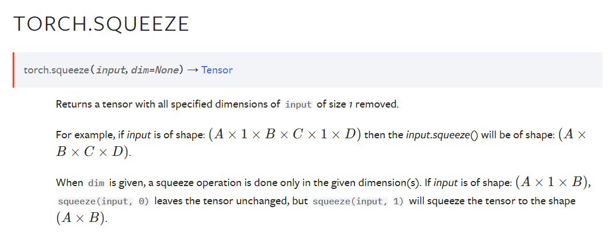
unsqueeze(): 增加尺寸为1的维度并返回
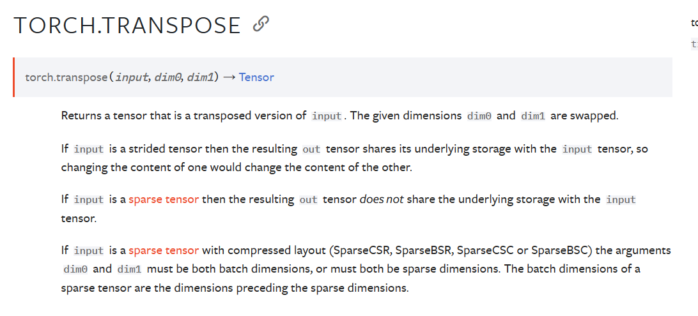

transpose(): 交换维度


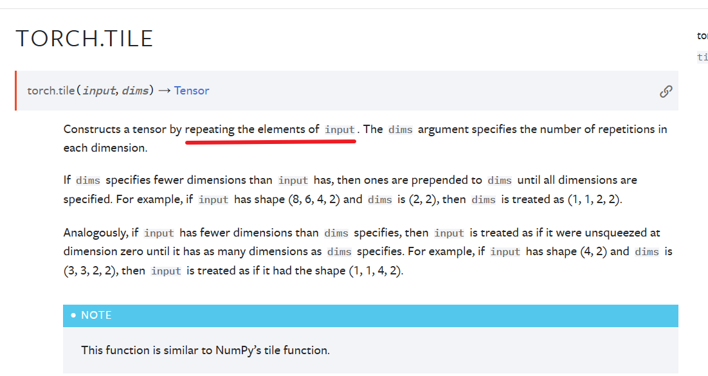

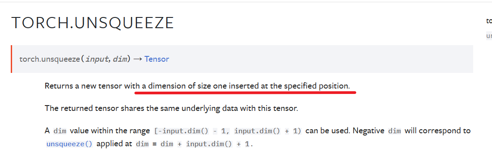

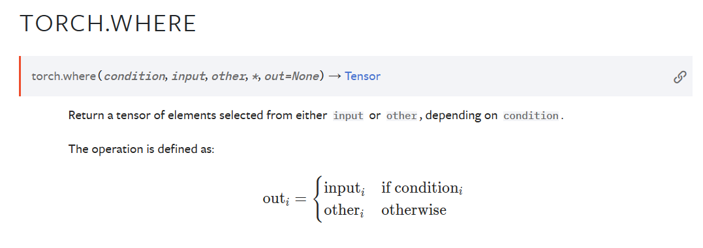


## Random sampling
seed(): 设置随机种子
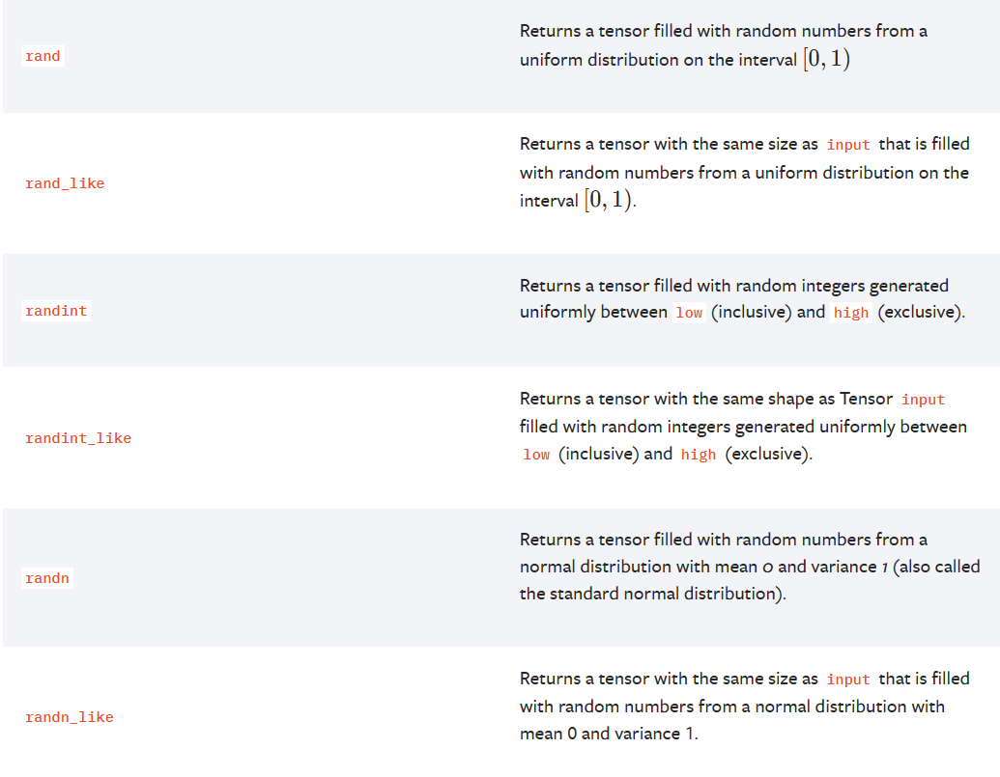

save():	
Saves an object to a disk file.
```
# Save to file
x = torch.tensor([0, 1, 2, 3, 4])
torch.save(x, 'tensor.pt')
# Save to io.BytesIO buffer
buffer = io.BytesIO()
torch.save(x, buffer)
```
load():
Loads an object saved with torch.save() from a file.

intra-op: 算子内并行

inter-op：算子间并行
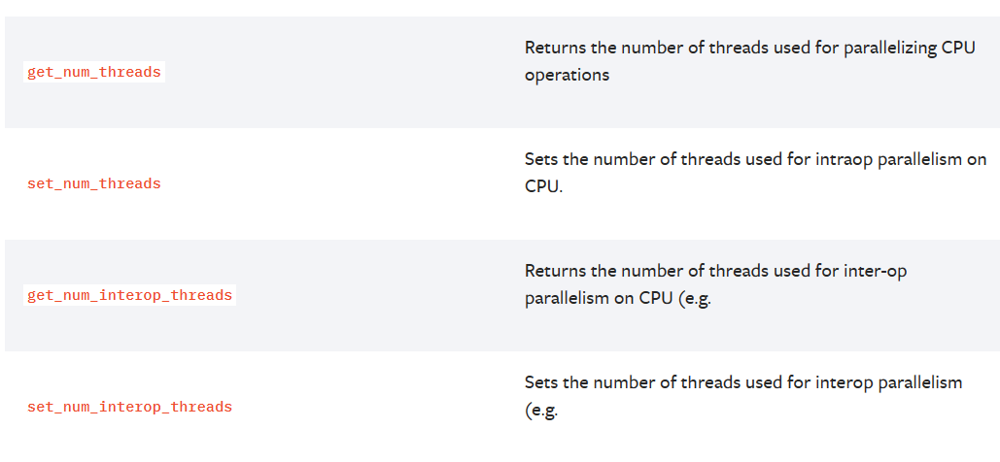

设置梯度
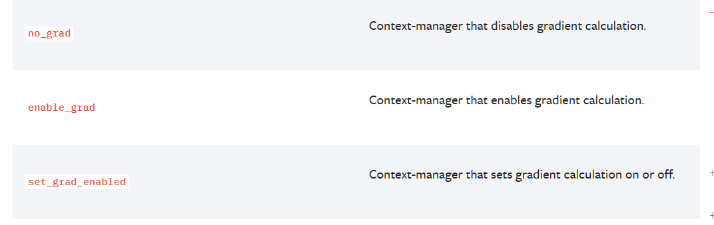

## Math operations
abs():

acos():

acosh():

add():
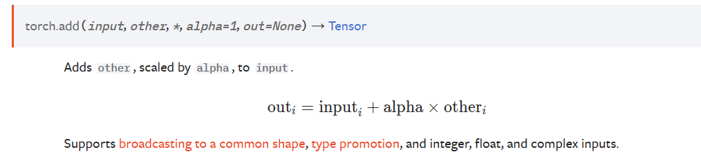

ceil(): 向上取整
floor(): 向下取整
round(): 四舍五入

clamp(): 数据预处理上下限
torch.clamp(input, min=None, max=None, *, out=None) → Tensor
clip()是clamp()的别名

div(): 输入除others
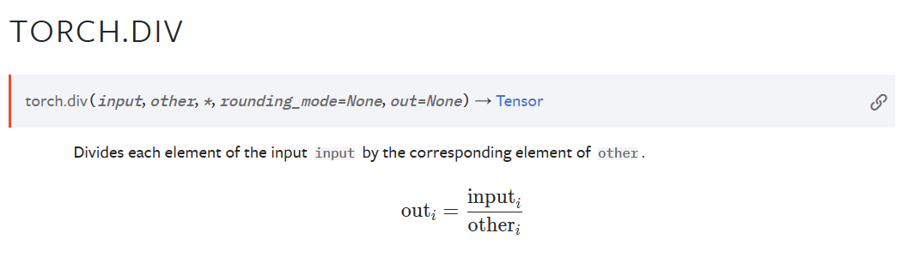
divide()是div()的别名

exp():  e的input_i次方
exp2()  2的input_i次方

log():
log10():
log2():

mul(): 矩阵乘法
sign(): 符号函数

sigmoid():
softmax():

sin(): 正弦函数
sinh()： 双曲正弦函数


sqrt(): 开方
square(): 平方
sub(): 减
div(): 除

max(): 返回最大值
min(): 返回最小值

argmax(): 返回最大值的维度
argmin(): 返回最小值的维度

amax(): 返回最大值
amin(): 返回最小值

aminmax(): 返回最大最小值

all():
any():

mean(): 返回均值
nanmean(): 去掉nan值的均值
median():
nanmedian():

std: 计算标准差
std_mean(): 计算均值和标准差

sum():
unique(): 去掉重复元素


eq()：
equal():
ge():  >=
gt():  >
le(): <=
lt(): <
diff():

clone():
detach():


flatten():
dot(): 两个矩阵相乘。


