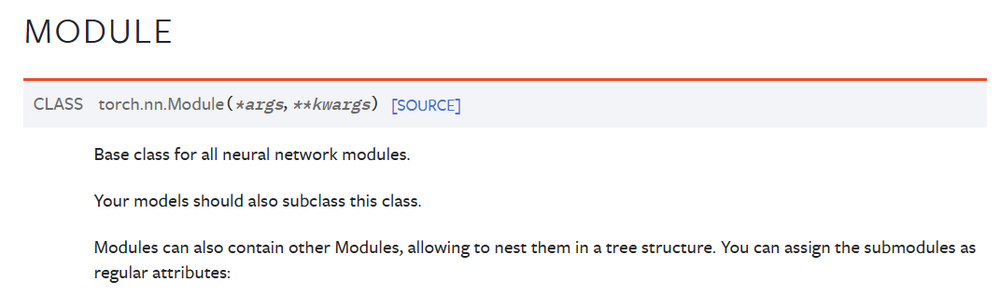
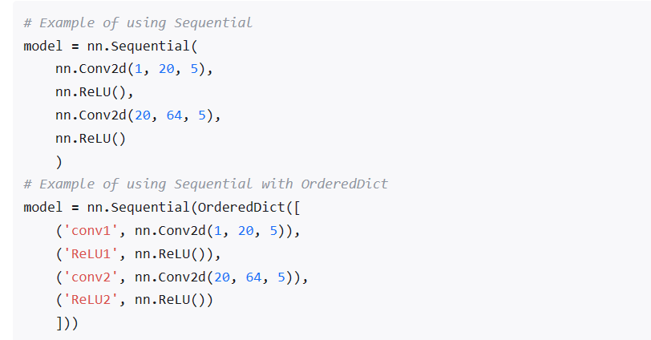
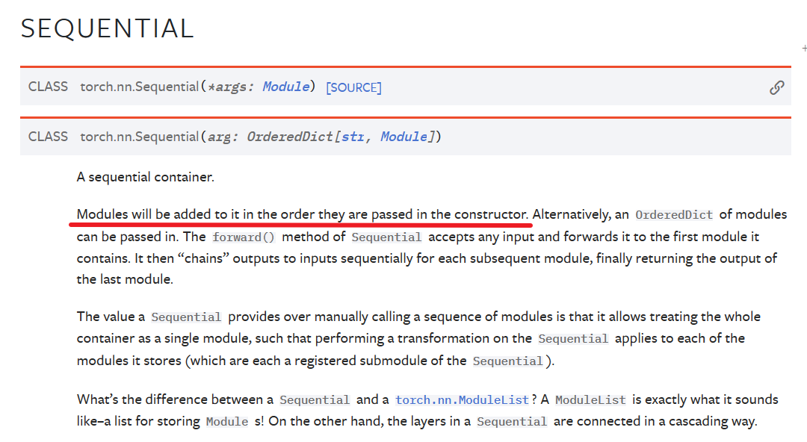

## PyTorch中的ModuleList和Sequential

nn.Sequential里面的模块按照顺序进行排列的，所以必须确保前一个模块的输出大小和下一个模块的输入大小是一致的。

nn.ModuleList，它是一个储存不同 module，并自动将每个 module 的 parameters 添加到网络之中的容器。Python 的 list 添加的卷积层和它们的 parameters 并没有自动注册到我们的网络中。

## Global Hooks For Module

## Convolution Layers
* nn.Conv1d

* nn.Conv2d

* nn.Conv3d

## Pooling layers
* nn.MaxPool1d
* nn.MaxPool2d
* nn.MaxPool3d

## Padding Layers
* nn.ZeroPad1d
* nn.ZeroPad2d
* nn.ZeroPad3d

## Non-linear Activations
* nn.ReLU
* nn.Sigmoid
* nn.SiLU

## Normalization Layers
* nn.BatchNorm1d
* nn.BatchNorm2d
* nn.BatchNorm3d

## Recurrent Layers
* nn.RNN
* nn.LSTM

## Transformer Layers
* nn.Transformer
* nn.TransformerEncoder
* nn.TransformerDecoder
* nn.TransformerEncoderLayer
* nn.TransformerDecoderLayer

## Linear Layers
* nn.Linear

## Dropout Layers
* nn.Dropout

## Loss Functions
* nn.L1Loss

