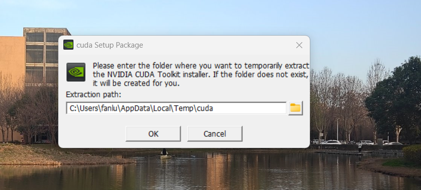
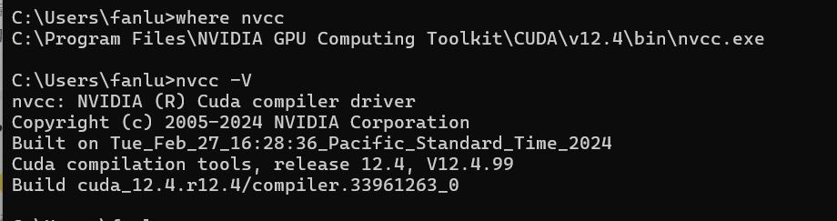

NVIDIA 系统信息报告，创建于： 04/18/2024 18:00:59
系统名称： LULIN

[显示]
操作系统：	Windows 10 Home, 64-bit
DirectX 版本：	12.0 
GPU 处理器：		NVIDIA GeForce GTX 1060
驱动程序版本：			531.41
驱动器类型：			DCH
Direct3D 功能级别：		12_1
CUDA 核心：		1280 
核心时钟：			1404 MHz 
内存数据速率：			8.01 Gbps
内存接口：			192-位 
内存带宽：			192.19 GB/秒
全部可用的图形内存：		14272MB
专用视频内存：			6144 MB GDDR5
系统视频内存：			0MB
共享系统内存：			8128MB
视频 BIOS 版本：		86.06.6D.00.17
IRQ：			Not used
总线：			PCI Express x16 Gen3
设备 ID：			10DE 1C20 39F517AA
部件编号：			2914 0030

[组件]

nvui.dll		8.17.15.3141		NVIDIA User Experience Driver Component
nvxdplcy.dll		8.17.15.3141		NVIDIA User Experience Driver Component
nvxdbat.dll		8.17.15.3141		NVIDIA User Experience Driver Component
nvxdapix.dll		8.17.15.3141		NVIDIA User Experience Driver Component
NVCPL.DLL		8.17.15.3141		NVIDIA User Experience Driver Component
nvCplUIR.dll		8.1.940.0		NVIDIA Control Panel
nvCplUI.exe		8.1.940.0		NVIDIA Control Panel
nvLicensingS.dll		6.14.15.3141		NVIDIA Licensing Server
nvViTvSR.dll		31.0.15.3141		NVIDIA Video Server
nvViTvS.dll		31.0.15.3141		NVIDIA Video Server
nvDispSR.dll		31.0.15.3141		NVIDIA Display Server
nvDispS.dll		31.0.15.3141		NVIDIA Display Server
nvDevToolSR.dll		31.0.15.3141		NVIDIA Licensing Server
nvDevToolS.dll		31.0.15.3141		NVIDIA 3D Settings Server
nvWSSR.dll		31.0.15.3141		NVIDIA Workstation Server
nvWSS.dll		31.0.15.3141		NVIDIA Workstation Server
NVCUDA64.DLL		31.0.15.3141		NVIDIA CUDA 12.1.98 driver
nvGameSR.dll		31.0.15.3141		NVIDIA 3D Settings Server
nvGameS.dll		31.0.15.3141		NVIDIA 3D Settings Server

还需要安装对应的CuDNN

具体文档：

https://blog.csdn.net/jhsignal/article/details/111401628

1、什么是CUDA
CUDA(ComputeUnified Device Architecture)，是显卡厂商NVIDIA推出的运算平台。 CUDA是一种由NVIDIA推出的通用并行计算架构，该架构使GPU能够解决复杂的计算问题。

2、什么是CUDNN
NVIDIA cuDNN是用于深度神经网络的GPU加速库。它强调性能、易用性和低内存开销。NVIDIA cuDNN可以集成到更高级别的机器学习框架中，如谷歌的Tensorflow、加州大学伯克利分校的流行caffe软件。简单的插入式设计可以让开发人员专注于设计和实现神经网络模型，而不是简单调整性能，同时还可以在GPU上实现高性能现代并行计算。

3、CUDA与CUDNN的关系
CUDA看作是一个工作台，上面配有很多工具，如锤子、螺丝刀等。cuDNN是基于CUDA的深度学习GPU加速库，有了它才能在GPU上完成深度学习的计算。它就相当于工作的工具，比如它就是个扳手。但是CUDA这个工作台买来的时候，并没有送扳手。想要在CUDA上运行深度神经网络，就要安装cuDNN，就像你想要拧个螺帽就要把扳手买回来。这样才能使GPU进行深度神经网络的工作，工作速度相较CPU快很多。
